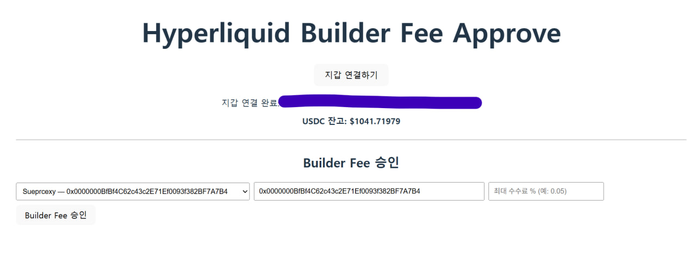

# Hyperliquid Builder Fee Approve (로컬 실행 가이드)

이 페이지는 Hyperliquid에서 특정 builder 코드(주소)에 대해 "최대 수수료(%)"를 승인(approve)하는 간단한 도구입니다.  
압축을 풀면 dist/ 폴더만으로 실행할 수 있습니다. Node.js는 필요 없습니다.

## 사전 준비
- Python 3.x (이미 설치되어 있다고 가정)
- 데스크톱 브라우저 + MetaMask(또는 EVM 호환 지갑 확장)
- 권장 브라우저: Chrome 또는 Brave

## 폴더 구성 확인
dist/
├─ index.html  
└─ assets/ … (여러 .js/.css 파일)

위처럼 dist 폴더가 있어야 합니다.

## 실행 방법(로컬)
1) 터미널/명령 프롬프트를 열고 dist 폴더로 이동합니다.

- macOS/Linux:
```bash
cd dist
python3 -m http.server 8000
```

- Windows (PowerShell):
```powershell
cd dist
python -m http.server 8000
```

2) 브라우저에서 아래 주소로 접속합니다.
- http://localhost:8000

3) MetaMask 확장이 설치되어 있어야 하며, 네트워크는 Arbitrum One(아비트럼 메인넷)으로 맞추는 것을 권장합니다.
   - MetaMask 네트워크 전환이 필요하면 브라우저 우측 상단 확장에서 Arbitrum One을 선택하세요.

## 사용 방법
1) 페이지에서 "지갑 연결하기" 버튼을 클릭 → MetaMask 팝업에서 연결 승인  
2) Builder 선택
   - 드롭다운에서 미리 정의된 빌더를 선택하거나,
   - "직접 입력 (수동)"을 선택한 뒤 옆 입력창에 0x로 시작하는 빌더 주소를 직접 입력
   - 모든 주소는 자동으로 체크섬(EIP-55)으로 정규화됩니다.
3) "최대 수수료 %" 입력
   - 예: 0.05 → 0.05% (5 bps)
   - 안전상 한도: 최대 1.00% 이내
4) "Builder Fee 승인" 클릭 → 지갑에서 서명/승인
5) 완료 후 화면에 “최대 수수료(저장값)”이 표시됩니다.

## 자주 묻는 질문(FAQ)과 오류 해결
- 파일을 더블클릭해서 열면 안 되나요?
  - 권장하지 않습니다. file://로 열면 모듈/지갑 통합에서 문제가 생길 수 있습니다. 반드시 위의 Python 서버 방식(HTTP)으로 실행하세요.
- 빈 화면 또는 "/src/main.ts" 관련 에러가 보입니다.
  - dist 폴더 바깥에서 서버를 띄운 경우입니다. 반드시 dist 폴더 안에서 서버를 실행하세요.
- 포트가 이미 사용 중입니다(Already in use).
  - 다른 포트를 쓰세요. 예) `python3 -m http.server 8001` 또는 `py -m http.server 8001`
- 지갑이 감지되지 않습니다.
  - MetaMask 설치/활성화/로그인 여부를 확인하고, 데스크톱 브라우저에서 http://localhost:8000 으로 접속했는지 확인하세요.
- 네트워크/서명 오류가 납니다.
  - MetaMask 네트워크를 Arbitrum One으로 전환해 보세요.
- 드롭다운에 내가 원하는 빌더가 없습니다.
  - dist만 받았을 경우 드롭다운 항목은 수정할 수 없습니다. 대신 "직접 입력 (수동)"을 선택하고 주소를 직접 입력하세요.
- 콘솔에 확장 프로그램(content-script) 에러 로그가 보입니다.
  - 일부 보안/광고 차단 확장에서 출력되는 무해한 로그일 수 있습니다. 기능에 영향이 없다면 무시해도 됩니다.

## 보안 유의사항
- 이 도구는 지갑 서명을 요청합니다. 서명 내용과 권한을 항상 확인한 뒤 승인하세요.
- 처음 사용하는 경우 소액으로 테스트해 보신 후 사용을 권장합니다.
- 공용 PC/네트워크 환경에서는 사용을 피하세요.

## 오프라인/사내 배포 팁
- dist 폴더만 전달하면 됩니다(이 저장소의 dist/ 그대로 사용).
- 수신자는 Python만 있으면 위 “실행 방법(로컬)”을 따라 바로 사용할 수 있습니다.

## 문의
- 이 도구에 포함된 빌더 목록을 수정하거나 기능을 확장하려면 소스 코드가 필요합니다. 소스 저장소/담당자에게 문의하세요.